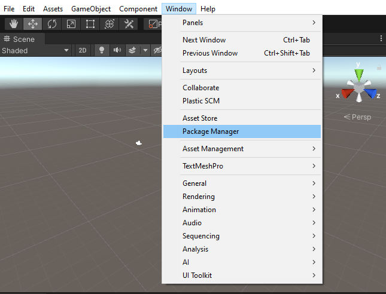
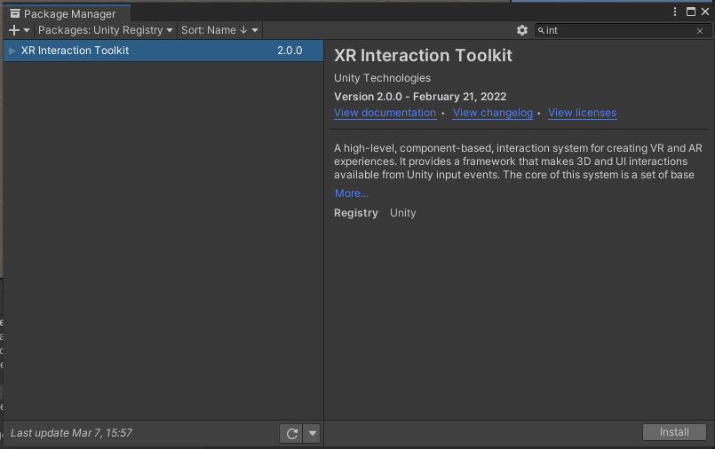
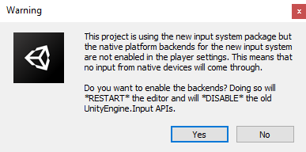
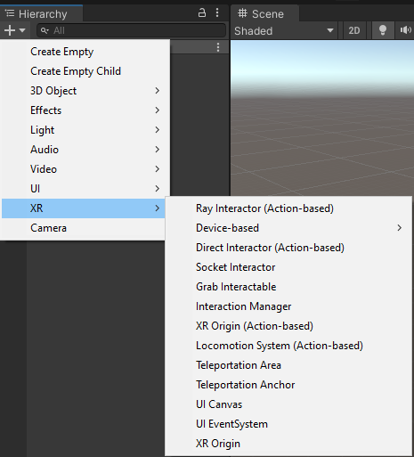
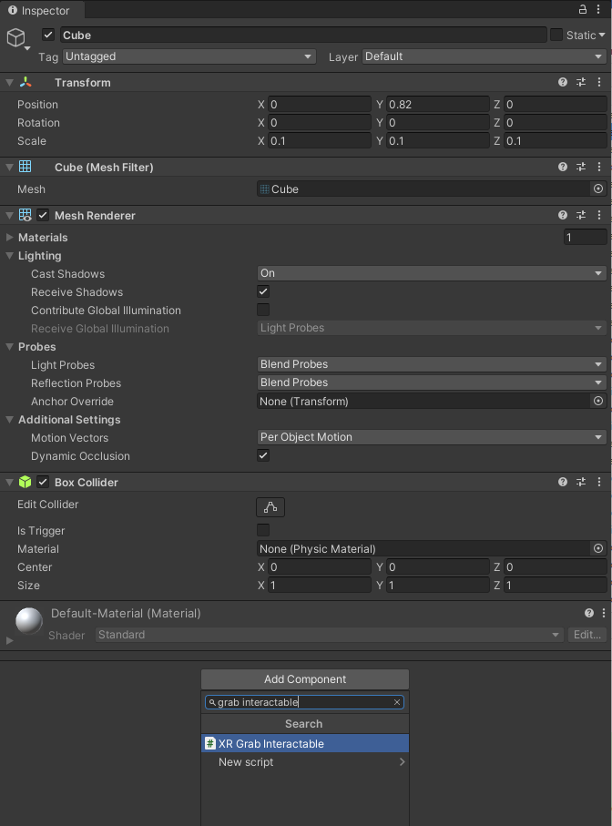
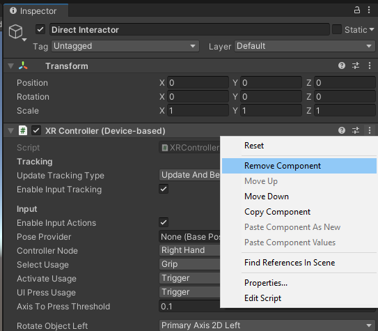
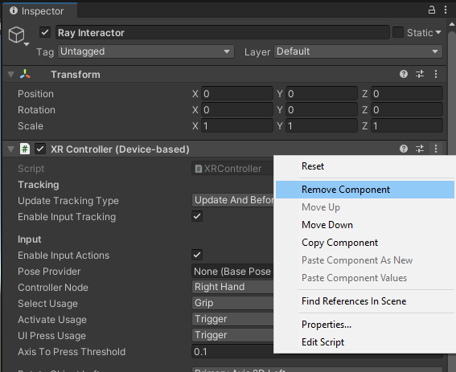

# XR Interaction Toolkit Integration

[Unity’s XR Interaction Toolkit](https://docs.unity3d.com/Packages/com.unity.xr.interaction.toolkit@2.0/manual/index.html) provides an Interaction System for Controller-based Input. It can be used to easily set up a VR rig, enable interactions with objects and UI and provide visual and haptic feedback.

It is made for controller Interaction, so Hand Tracking Interactions don’t work from scratch. However, Ultraleap hand tracking can be integrated by following the steps below.

The integrated hand tracking supports the following XRI features:

- Object hover, grab, activate
- UI interaction with rays
- locomotion - teleport with rays
- Audio and visual feedback

It doesn’t support:

- locomotion - snap turn, continuous movement
- haptic feedback

## Setup
### 1) Set up a Scene using the XR Interaction Toolkit
The XR interaction toolkit has three main components that should be every scene:
The **Interaction Manager** is needed at least once in a scene and facilitates all interactions between Interactors and Interactables.
An **Interactor** specifies how to find Interactables and how the input device data is used to interact with them. It needs an XRController to receive input from an XR Input Device.
An **Interactable** is any object that an Interactor can interact with. It defines possible interactions with the object.

The following is a short step-by-step on how you could set up a simple example scene with a interactable Cube with the XR Interaction Toolkit. Alternatively, you can follow [Unity’s Setup Guides](https://docs.unity3d.com/Packages/com.unity.xr.interaction.toolkit@2.0/manual/installation.html) or download the [Example Scenes](https://github.com/Unity-Technologies/XR-Interaction-Toolkit-Examples).

- Create a new Unity Project and a new Scene
- Configure your project to work with XR
- Go to Windows → Package Manager, and choose ‘Packages: Unity Registry’. Find the ‘XR Interaction Toolkit’ in the list, select it and click ‘Install’ in the bottom right corner

- Click ‘Yes’ and wait for Unity to restart

- In the Hierarchy Tab, click the Plus → XR → XR Origin and Interaction Manager

- Add a floor plane and a cube to the scene and adjust the cube’s position and scale
- Attach the ‘XR Grab Interactable’ script to the cube. This allows any interactors that you add later (ie. Controllers or Hands) to interact with the cube. This also automatically adds a Rigidbody to the cube if it doesn’t have one already.

- Optionally you can now add tracked Controllers to the scene. Skip this step if you want to use hand tracking interactions without any controllers. 
Add Ray Interactors or Direct Interactors using Controllers by going to the hierarchy and clicking on the Plus → XR and then choosing any interactors from that list.

### 2) Set up Ultraleap Hand Tracking
- Follow the [Getting Started Guide](https://docs.ultraleap.com/unity-api/unity-user-manual/getting-started.html) to install Ultraleap’s Unity Plugin (make sure to import both the ‘Tracking’ and the ‘Tracking Preview’ package)
- Keep following the below steps to set up the tracked hands from scratch. Alternatively, you could also drag the prefab ‘Tracked Hands Ultraleap’ into your scene now (Packages/Ultraleap Tracking Preview/XRI Integration/Tracked Hands Ultraleap.prefab) and you should be able to just hit play.
- Add a the prefabs ‘Service Provider (XR)’ and ‘CapsuleHands’ to your scene. When you hit play, you should now be able to see your tracked hands.

### 3) Integrate Hand tracking into the Interaction Toolkit
- Add an Interactor to the scene. 
To be able to interact with the interactable cube, you need to have an interactor in the scene that specifies how the interaction works. There are two main Interactors that you can choose from: The **Direct Interactor** allows you to interact with objects in close proximity. It uses a collider that follows your hand to determine whether or not an interactable object is within reach. The **Ray Interactor** enables interaction with objects that are further away and with UI. It draws a ray that allows interaction with objects when it intersects with them. For this example, lets add a direct interactor to the right hand and a ray interactor to the left.
	- In the Hierarchy click on the Plus → XR → Device-based → Ray Interactor and Direct Interactor.
- Select the Direct Interactor in the Hierarchy and look at the Inspector. The direct Interactor has three main components: An ‘XR Controller’ that gets input data from the Input System and converts it to a usable format. An ‘XR Direct Interactor’ that uses the data that the ‘XR Controller’ provides to enable interactions. And a ‘Sphere Collider’ that is used to determine whether an interactable object is within reach or not. Hand tracking can be integrated by replacing the ‘XR Controller’ with a component that gets input data from the Leap Service Provider and converts it to the usable format that the ‘XR Direct Interactor’ needs.
	- Remove the component ‘XR Controller (Device-based)’ from the Direct Interactor

	
	- Add the script ‘Tracked Hands Controller' to the Direct Interactor (Packages/Ultraleap Tracking Preview/XRI Integration/TrackedHandsController.cs) and assign ‘Capsule Hand Right’ to its Hand Model. You can also modify Select, Activate and UI Press Interaction Poses.

	
	- If you hit play now, you should be able to pick up the cube with your right hand by making a pinch pose.
- Select the Ray Interactor in the Hierarchy and look at the Inspector. Similarly to the Direct Interactor, the Ray interactor has an ‘XR Controller’ component that gets input data from the input system and provides it to the ‘XR Ray Interactor’. The ‘XR Ray Interactor’ creates a Ray to determine which interactable objects the interactor can interact with and the ‘Line Renderer’ and ‘XR Interactor Line Visual’ visualize the ray and change its color depending on its intersection with interactables. Hand Tracking can be integrated again by replacing the ‘XR Controller’ with the ‘Tracked Hands Controller’:
	- Remove the component ‘XR Controller (Device-based)’ from the Direct Interactor

	
	- Add the script ‘Tracked Hands Controller' to the Direct Interactor (Packages/Ultraleap Tracking Preview/XRI Integration/TrackedHandsController.cs) and assign ‘Capsule Hand Left’ to its Hand Model. You can also modify Select, Activate and UI Press Interaction Poses.

	
	- Because this is a ray interactor and the ray was made for controller input rather than hand input, you need an extra component to make the ray direction better: Add the ‘FarFieldDirection’ Prefab to your scene (Packages/Ultraleap Tracking Preview/XRI Integration/FarFieldDirection.prefab).
	- If you hit play now, you should see a ray being cast from your left hand and you should be able to pick up the interactable cube when the ray intersects with it and you make a pinch pose.

## Further Steps
The above setup should enable you to use the main functionality of the XR Interaction Toolkit with tracked hands instead of controllers. There are a couple of extra functionalities that you could include in your project:

### Hand and Controller swapping
If you want to use both hand tracking and controllers in your scene, you can add interactors for both and then combine them using our XRControllerSupport. The XRControllerSupport has scripts that enable automatic swapping between hands and controllers. If it is detected that your hand is holding the controller, the controller is used, and when you let go of the controller, your hand is used. For an example of this, see the XRControllerSupport scene in the tracking preview examples. (Note that the XRControllerSupport is a preview feature and might change in future or have small bugs)

### Teleportation
When using tracked hands, teleportation works in a very similar way as with controllers in the XR Interaction Toolkit. A Ray Interactor can be pointed at a teleportation area or anchor and the Select Interaction Pose is used to teleport.

If using one ray interactor for both UI interaction and teleportation, you might teleport when trying to interact with UI that has a teleportation area behind it. If your scene is set up like that, you might separate the ray interactor into two: One ray interactor can be solely for teleportation and one can be for interactions with UI and objects.

- Set up a new Layer for teleportation:
	- Select your Teleportation Area and go to the inspector
	- In the top right corner, select the dropdown next to ‘Layer’ and click ‘Add Layer…’
	- Type in a name for your new layer (eg. ‘teleportation’)
	- Go back to your teleportation area and select the new layer in the top right corner
- Add a new ray interactor (following the setup steps in 3) above) and configure the layer masks:
	- The XR Ray Interactor Component has a ‘Interaction Layer Mask’ property. Untick the new teleportation layer on one of the ray interactors, and select only the teleportation layer on the other ray interactor.
- turn off the new teleportation ray interactor, whenever you are interacting with UI:
	- On the XR Ray Interactor Component of the non-teleport ray interactor, edit the Interactor event to turn off the teleportation ray interactor gameobject on hover entered and turn it on on hover exited.

 